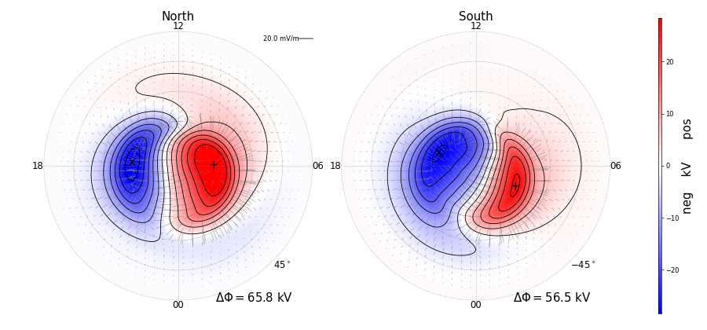

|DOI| 

Overview
========

Python interface for the Swarm Ionospheric Polar Electrodynamics (SWIPE) model.

The SWIPE model is an empirical model of high-latitude ionospheric electrodynamics, and is a combination of the Average Magnetic field and Polar current System (AMPS) model and the Swarm High-latitude Convection (Swarm Hi-C) model.

AMPS
-----------------------------------------------

The AMPS model magnetic field and currents are continuous functions of solar wind velocity, the interplanetary magnetic field, the tilt of the Earth's dipole magnetic field with respect to the Sun, and the 10.7 cm solar radio flux index F10.7. Given these parameters, model values of the ionospheric magnetic field can be calculated anywhere in space, and, with certain assumptions, on ground. The full current system, horizontal + field-aligned, are defined everywhere in the polar regions. The model is based on magnetic field measurements from the low Earth orbiting Swarm and CHAMP satellites.

Swarm Hi-C
-----------------------------------------------
The Swarm Hi-C model high-latitude ionospheric convection is a function of the same input parameters used for the AMPS model. Given these parameters, model values of the high-latitude ionospheric convection, potential, and electric field can be calculated. The model is based on ion drift measurements from Swarm A and Swarm C.

pyswipe can be used to calculate and plot several different quantities on a grid. The parameters that are available for calculation/plotting are:

- electric potential (scalar)
- electric field E (vector)
- convection v = - cross(E, B) (vector)
- height-integrated electromagnetic work = dot(J, E) (scalar) in the earth's rotating frame of reference, with J given by the AMPS model and E by Swarm Hi-C
- Hall and Pedersen conductances (scalars)
- Poynting flux (scalar)

For questions and comments, please contact spencer.hatch at uib.no

Installation
------------

Using pip::

    pip install pyswipe 

Dependencies:

- numpy
- pandas
- dask
- matplotlib (with LaTeX support, see https://matplotlib.org/users/usetex.html)
- scipy (scipy.interpolate for plotting purposes)
- apexpy (magnetic coordinate conversion)

Quick Start
-----------
.. code-block:: python

    >>> # initialize by supplying a set of external conditions:
    >>> from pyswipe import SWIPE
    >>> m = SWIPE(350, # Solar wind velocity in km/s 
                  -4, # IMF By (GSM) in nT
                  -3, # IMF Bz (GSM) in nT, 
                  20, # dipole tilt angle in degrees 
                  80) # F107_index
    >>> # make summary plot:
    >>> m.plot_potential()

    

Documentation
-------------
IF this were pyamps, we could point to `http://pyamps.readthedocs.io` . But it's not!

References
----------
Hatch, S. M., Vanhamäki, H., Laundal, K. M., Reistad, J. P., Burchill, J. K., Lomidze, L., Knudsen, D. J., Madelaire, M., & Tesfaw, H. (2024). Does high-latitude ionospheric electrodynamics exhibit hemispheric mirror symmetry? Annales Geophysicae, 42(1), 229–253. `doi: 10.5194/angeo-42-229-2024 <https://doi.org/10.5194/angeo-42-229-2024>`_

Laundal, K. M., Finlay, C. C., Olsen, N. & Reistad, J. P. (2018), Solar wind and seasonal influence on ionospheric currents from Swarm and CHAMP measurements, Journal of Geophysical Research - Space Physics. `doi:10.1029/2018JA025387 <https://agupubs.onlinelibrary.wiley.com/doi/10.1029/2018JA025387>`_

Acknowledgments
---------------
The Swipe model forward code is produced with support from the European Space Agency through the Swarm Data Innovation and Science Cluster (Swarm DISC), ESA Contract no. 4000109587/13/I-NB. 

The inverse code for producing the Swarm Hi-C model coefficients is available here: https://zenodo.org/badge/latestdoi/674153432

For more information on the Swipe project, please visit https://earth.esa.int/eogateway/activities/swipe

For more information on Swarm DISC, please visit https://earth.esa.int/web/guest/missions/esa-eo-missions/swarm/disc

.. |DOI| image:: https://zenodo.org/badge/685879333.svg
        :target: https://zenodo.org/badge/latestdoi/685879333
